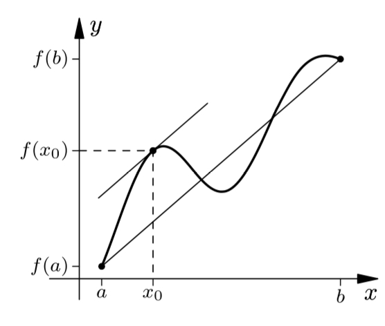

> [!THEOREM] Satz: Mittelwertsatz der Differentialrechnung
> In jedem Intervall $(a;b) \subset D$, wo die [Funktion](../../Funktionen/Funktion.md) $f: D \subseteq \mathbb{R}\to\mathbb{R}$ [differenzierbar](../Ableitung%20und%20Differenzierbarkeit.md) und auf $[a;b]$ [stetig](../../Grenzwerte%20von%20Funktionen/Stetigkeit/Stetigkeit.md) ist, gibt es ein $x_0 \in (a;b)$ mit
> $$f'(x_0) = \frac{f(b)-f(a)}{b-a}$$

> [!NOTE] Note: Graphische Bedeutung
> Der Mittelwertsatz besagt, dass die Sekannte durch die Punkte $(a; f(a))$ und $(b; f(b))$ parallel zu der Tangente an einen Punkt $(x_0; f(x_0))$ ist, wobei $x_0\in (a;b)$.
> 

> [!THEOREM] Satz: Satz von Rolle
> Sei $f: [a;b] \to \mathbb {R}$ auf  $[a;b]$ [stetig](../../Grenzwerte%20von%20Funktionen/Stetigkeit/Stetigkeit.md) und auf $(a; b)$ [differenzierbar](../Ableitung%20und%20Differenzierbarkeit.md).
> 
> Wenn $f(a)=f(b)$, dann gibt es mindestens ein $x_0\in (a; b)$ mit  $f'(x_0) = 0$.
> > [!PROOF]- Beweis
> > Folgt direkt aus dem Mittelwertsatz.