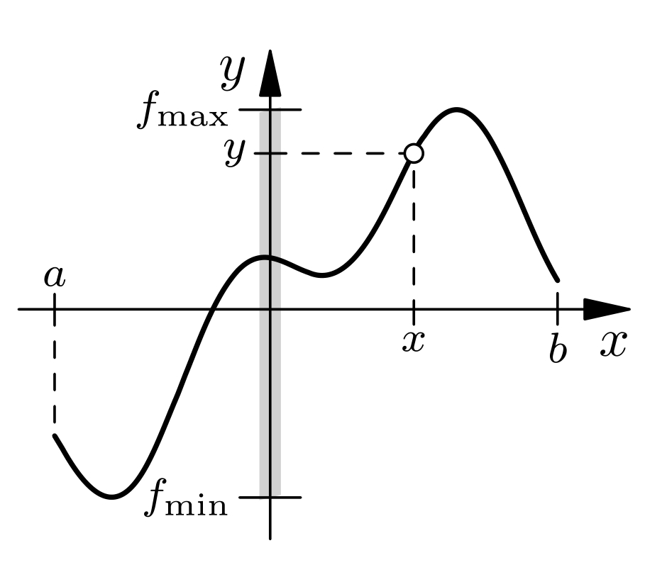

---
Related:
- "[[Stetigkeit]]"
---

> [!THEOREM] Satz: Zwischenwertsatz
> Sei $f: [a; b] \subseteq\mathbb{R}\to\mathbb{R}$ eine stetige Funktion mit $f_{\text{min}} = f(x_{\text{min}})$ und $f_{\text{max}} = f(x_{\text{max}})$. Dann gibt es zu jedem $y \in [f_{\text{min}}; f_{\text{max}}]$ ein $x\in [a;b]$ mit $y = f(x)$.
> 
> 