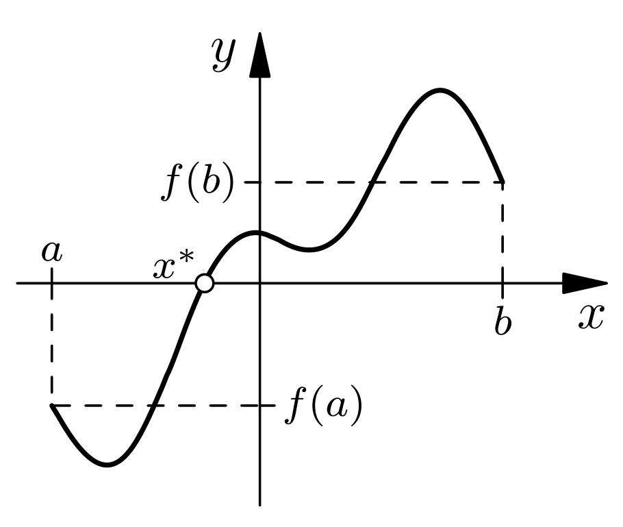

---
Related:
- "[[Stetigkeit]]"
---

> [!IMPORTANT]+ Satz: Nullstellensatz
> Für jede stetige Funktion $f: [a; b] \subseteq\mathbb{R}\to\mathbb{R}$ mit $f(a)\lt 0$ und $f(b) \gt 0$ (oder umgekehrt) gibt es mindestens ein $x\in[a;b]$ mit $f(x) = 0$.
> 
> 