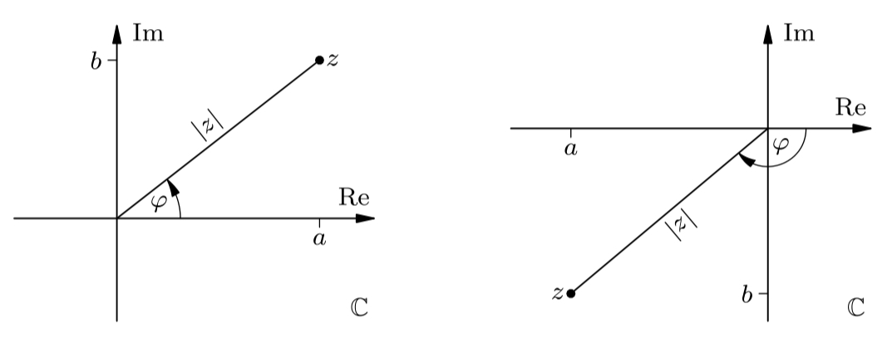

> [!DANGER] Definition: Polarform einer komplexen Zahl
> Da [komplexe Zahlen](../Komplexe%20Zahlen.md) Punkten in der [komplexen Zahlenebene](Die%20komplexe%20Zahlenebene.md) entsprechen, lässt sich jede Zahl $z \in \mathbb{C}$ in der sogenannten **Polarform** $z = r(\cos \varphi + \mathrm{i}\sin \varphi)$ darstellen, wobei $r$ die [Länge](../Komplexe%20Zahlen.md#^size) und $\varphi$ das **(Haupt-)Argument** von $z$ sind.
> > [!DANGER] Definition: (Haupt-)Argument
> > Das **(Haupt-)Argument** $\arg(z) \overset{\text{def}}{=}\varphi\in (-\mathrm{\pi}; \mathrm{\pi}]$ von $z$ nennt man den Winkel, der von $z$ und der positiven reellen Achse eingeachlossen wird.
> 
> > [!DANGER] Definition: Polarkoordinaten
> > Das Paar $(r,\varphi)$ nennt man die **Polarkoordinaten** von $z$.

