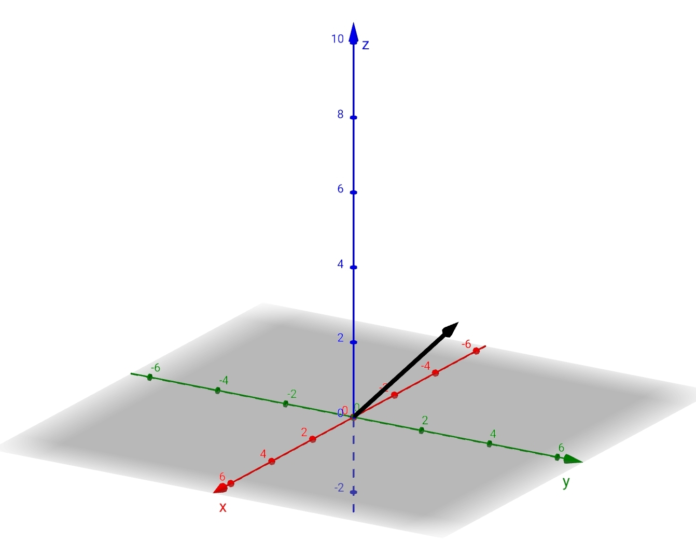

> [!DEFINITION] Definition: Vektoren als Pfeilen
> Jeder [reelle Spaltenvektor](../Vektoren%20als%20Matrizen/Reelle%20Vektoren/Reeller%20Spaltenvektor.md) $\vec{v} = \begin{bmatrix}v_x \\ v_y \\ v_z\end{bmatrix} \in \mathbb{R}^3$ entspricht einem Pfeil im 3D-Raum, der aus dem Bezugspunkt $(0, 0, 0)$ stammt und bis zu dem Punkt $(v_x,v_y,v_z)$ reicht.
> 

> [!DEFINITION] Definition: Vektorkomponenten
> Man nennt die Zahlen $v_x,v_y,v_z$ jeweils die $x,y,z$-**Komponenten** des Vektors $\vec{v}=\begin{bmatrix}v_x \\ v_y \\ v_z\end{bmatrix}$.
> > [!NOTE] Notiz: Darstellung in der Standardbasis
> > Es sei denn anders verabredet, nimmt man an, dass sich die Komponenten auf die [Standardbasis](Standardbasis.md) beziehen, also $\vec{v}$ ist ein [Koordinatenvektor](../Abstrakte%20lineare%20Algebra/Basis/Koordinatenvektor.md) bezüglich der Standardbasis:
> > $$\vec{v} = v_x\hat\imath + v_y\hat\jmath + v_z \hat k$$