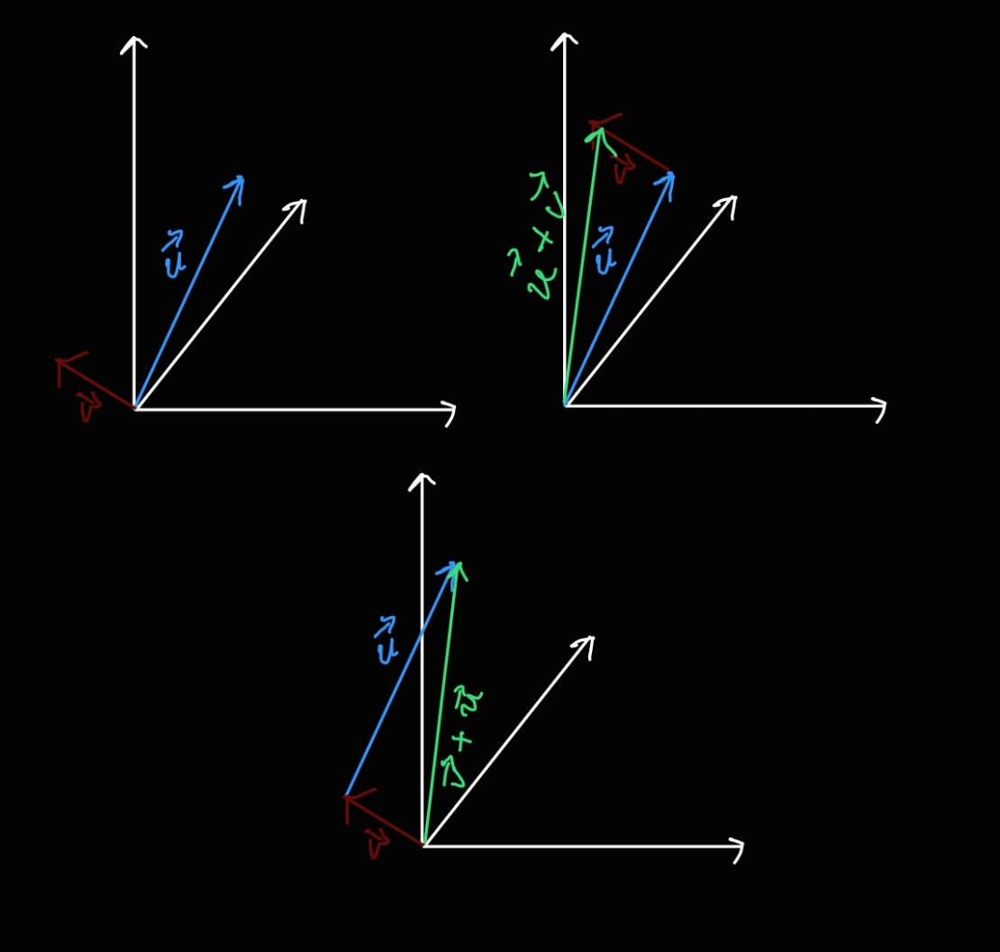

> [!THEOREM] Geometrische Addition
> Um zwei Vektoren $\vec{u},\vec{v}\in\mathbb{R}^3$ geometrisch zu [addieren](../../Matrizen/Matrizenoperationen/Addition.md) braucht man nur den Anfang eines der Vektoren ans Ende des anderen anzuschließen.
> 
> > [!NOTE] Notiz: Substrahieren
> > Das Substrahieren $\vec{u}-\vec{v}$ ist äquivalent zu der Addition $\vec{u}+(-\vec{v})$.