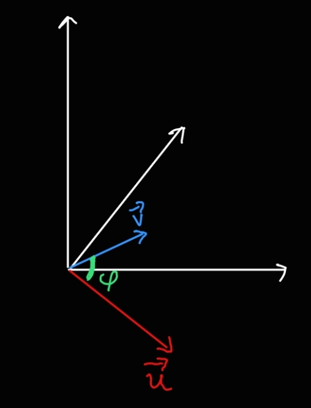

> [!THEOREM] Geometrisches Skalarprodukt
> Für das [kanonische Skalarprodukt](../../Vektoren%20als%20Matrizen/Reelle%20Vektoren/Reelles%20Skalarprodukt.md) $\vec{u}^\mathsf{T}\cdot\vec{v}$ zweier [reeller Vektoren](../../Vektoren%20als%20Matrizen/Reelle%20Vektoren/Reeller%20Spaltenvektor.md) $\vec{u},\vec{v}\in\mathbb{R}^3$ gilt
> $$\vec{u}^\mathsf{T}\cdot\vec{v} = ||\vec{u}||||\vec{v}||\cos\angle(\vec{u};\vec{v})$$
> 
> > [!PROOF]- Beweis
> > Nach dem Kosinussatz gilt
> > $$\cos\angle(\vec{u};\vec{v}) = \frac{||\vec{u}||^2+||\vec{v}||^2-||\vec{u}-\vec{v}||^2}{2||\vec{u}||||\vec{v}||}$$
> > Also
> > $$||\vec{u}||||\vec{v}||\cos\angle(\vec{u};\vec{v}) = \frac{||\vec{u}||^2+||\vec{v}||^2-||\vec{u}-\vec{v}||^2}{2}$$
> > Wir müssen nun beweisen, dass die rechte Seite gleich $\vec{u}^\mathsf{T}\cdot\vec{v}$ ist.
> > $$\begin{align}||\vec{u}||^2+||\vec{v}||^2-||\vec{u}-\vec{v}||^2 &= \vec{u}^\mathsf{T}\cdot\vec{u}+\vec{v}^\mathsf{T}\cdot\vec{v} - (\vec{u}-\vec{v})^\mathsf{T}\cdot(\vec{u}-\vec{v}) \\ &= u_x^2 + u_y^2 + u_z^2+ v_x^2 + v_y^2 + v_z^2 - (u_x-v_x)^2-(u_y-v_2)^2-(u_z-v_z)^2 \\ &= u_x^2 + u_y^2 + u_z^2+ v_x^2 + v_y^2 + v_z^2  - u_x^2 + 2 u_x v_x - v_x^2 - u_y^2+2u_y v_y - v_y^2 - u_z^2 + 2u_z v_z - v_z^2 \\ &= 2u_x v_x + 2 u_y v_y + 2 u_z v_z\end{align}$$
> > Das Skalarprodukt ist
> > $$\vec{u}^\mathsf{T}\cdot\vec{v} = u_xv_x + u_yv_y + u_zv_z = \frac{2u_x v_x + 2 u_y v_y + 2 u_z v_z}{2} = \frac{||\vec{u}||^2+||\vec{v}||^2-||\vec{u}-\vec{v}||^2}{2} = ||\vec{u}||||\vec{v}||\cos\angle(\vec{u};\vec{v})$$