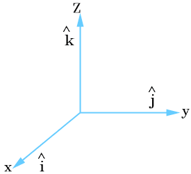

> [!IMPORTANT] Standardbasis
> Der [3D-Raum](Der%203D-Raum.md) $\mathbb{R}^3$ hat die [Standardbasis](../Vektoren%20als%20Matrizen/Standardbasis.md)
> $$\left\{\hat{\imath} = \begin{bmatrix}1 \\ 0 \\ 0\end{bmatrix}, \hat{\jmath} = \begin{bmatrix}0 \\ 1 \\ 0\end{bmatrix}, \hat k = \begin{bmatrix}0 \\ 0 \\ 1\end{bmatrix}\right\},$$
> wo die Vektoren $\hat\imath, \hat\jmath, \hat k$ jeweils entlang der $x,y,z$-Achse sind.
> 