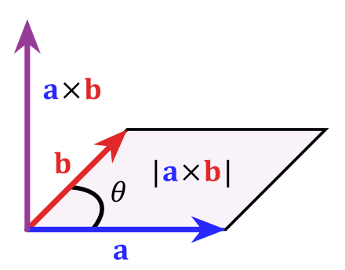
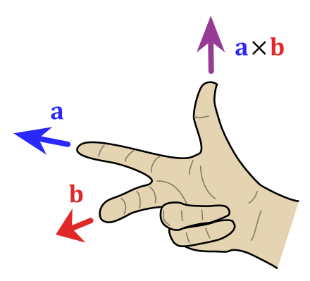

>[!DEFINITION] Definition: Kreuzprodukt
>Das **Kreuzprodukt** eines [Vektors](Reeller%20Spaltenvektor.md) $\vec{a} = \begin{bmatrix}x_a, y_a, z_a\end{bmatrix}^\mathsf{T}\in\mathbb{R}^3$ mit einem anderen [Vektor](Reeller%20Spaltenvektor.md) $\vec{b}=\begin{bmatrix}x_b, y_b, z_b \end{bmatrix}^\mathsf{T} \in \mathbb{R}^3$ ist der [Vektor](Reeller%20Spaltenvektor.md)
>
>$$\vec{a}\times\vec{b}\overset{\text{def}}{=} \begin{bmatrix}y_a z_b - z_a y_b \\ z_a x_b - x_a z_b \\ x_a y_b - y_a x_b\end{bmatrix}$$
>
>
>
>>[!THEOREM] Satz: Richtung des Kreuzprodukts
>>Das Kreuzprodukt $\vec{a}\times\vec{b}$ ist [orthogonal](../../Abstrakte%20lineare%20Algebra/Euklidische%20Vektorräume/Orthogonalität.md) sowohl zu $\vec{a}$ als auch zu $\vec{b}$. Um seine Richtung zu bestimmen, folge der Rechte-Hand-Regel:
>>
>>
>>>[!PROOF]- Beweis
>>
>
>>[!THEOREM] Satz: Länge des Kreuzprodukts
>>Die [Länge](Länge.md) des Kreuzprodukts ist
>>
>>$$||\vec{a}\times\vec{b}|| = ||\vec{a}||\,||\vec{b}||\sin \angle(\vec{a};\vec{b})$$
>>
>>>[!PROOF]- Beweis